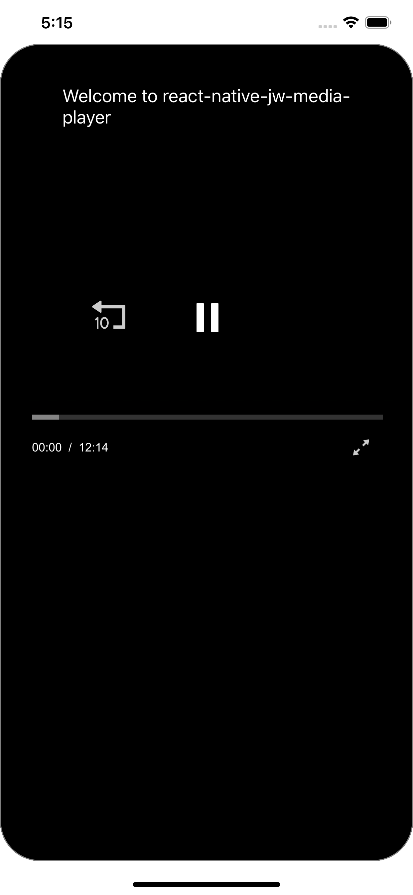
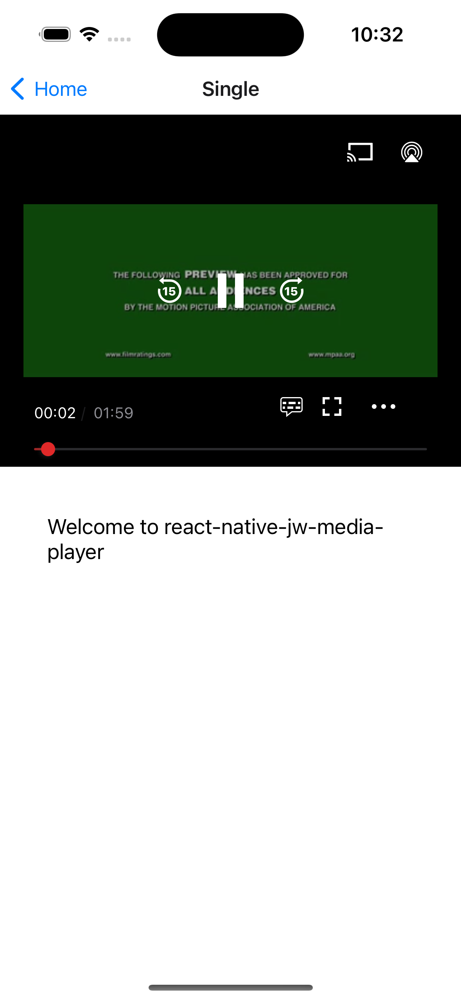
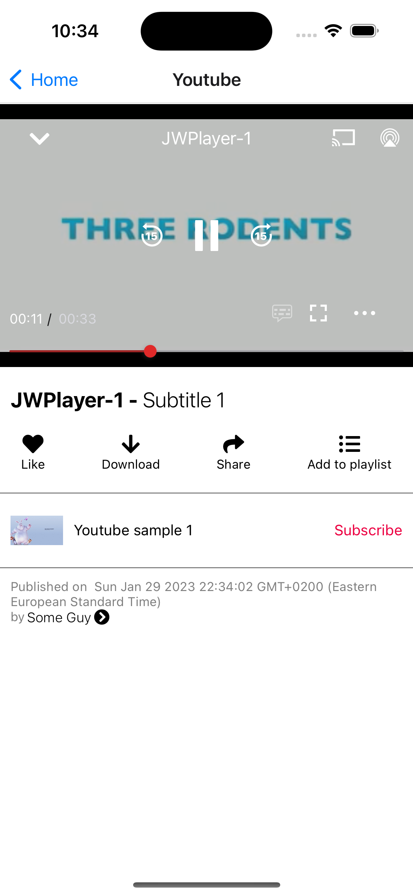

# react-native-jw-media-player

### A react-native bridge for JWPlayer native SDK's

⚠️ Important you need a `JWPlayer` license to use this library https://jwplayer.com/





## Getting started

`npm i react-native-jw-media-player --save`

### Mostly automatic installation

For iOS you have to run `cd ios/` && `pod install`.

For Android the package is automatically linked.

### Important

This **README** is for `react-native-jw-media-player` version `0.2.0` and higher, for previous version check out the [Old README](./Pre.0.2.0_README.md).

Since version `0.2.0` we use the new JWPlayerKit && SDK 4 check out [iOS get started](https://developer.jwplayer.com/jwplayer/docs/ios-get-started) && [Android get started](https://developer.jwplayer.com/jwplayer/docs/android-get-started)

##### Android dependencies

Insert the following lines inside the allProjects.dependencies block in `android/build.gradle`:

```
maven{
    url 'https://mvn.jwplayer.com/content/repositories/releases/'
}
```

As so

```
allprojects {
    repositories {
        mavenLocal()
        maven {
            // All of React Native (JS, Obj-C sources, Android binaries) is installed from npm
            url("$rootDir/../node_modules/react-native/android")
        }
        maven {
            // Android JSC is installed from npm
            url("$rootDir/../node_modules/jsc-android/dist")
        }

        google()
        jcenter()
        maven { url 'https://jitpack.io' }
        // Add these lines
        maven{
            url 'https://mvn.jwplayer.com/content/repositories/releases/'
        }
    }
}
```

## Usage

```javascript
...

import JWPlayer, { JWPlayerState } from 'react-native-jw-media-player';

...

const styles = StyleSheet.create({
  container: {
    flex: 1,
  },
  player: {
    flex: 1,
  },
});

...

const playlistItem = {
  title: 'Track',
  mediaId: -1,
  image: 'http://image.com/image.png',
  description: 'My beautiful track',
  startTime: 0,
  file: 'http://file.com/file.mp3',
  autostart: true,
  repeat: false,
  displayDescription: true,
  displayTitle: true,
  tracks: [
    {
      file: 'http://file.com/english.vtt',
      label: 'en'
    },
    {
      file: 'http://file.com/spanish.srt',
      label: 'es'
    }
  ],
  sources: [
    {
      file: 'http://file.com/file.mp3',
      label: 'audio'
    },
    {
      file: 'http://file.com/file.mp4',
      label: 'video',
      default: true
    }
  ]
}

const config = {
  license:
    Platform.OS === 'android'
      ? 'YOUR_ANDROID_SDK_KEY'
      : 'YOUR_IOS_SDK_KEY',
  backgroundAudioEnabled: true,
  autostart: true,
  styling: {
    colors: {
      timeslider: {
        rail: "0000FF",
      },
    },
  },
  playlist: [playlistItem],
}

...

async isPlaying() {
  const playerState = await this.JWPlayer.playerState();
  return playerState === JWPlayerState.JWPlayerStatePlaying;
}

...

render() {

...

<View style={styles.container}>
  <JWPlayer
    ref={p => (this.JWPlayer = p)}
    style={styles.player}
    config={config}
    onBeforePlay={() => this.onBeforePlay()}
    onPlay={() => this.onPlay()}
    onPause={() => this.onPause()}
    onIdle={() => console.log("onIdle")}
    onPlaylistItem={event => this.onPlaylistItem(event)}
    onSetupPlayerError={event => this.onPlayerError(event)}
    onPlayerError={event => this.onPlayerError(event)}
    onBuffer={() => this.onBuffer()}
    onTime={event => this.onTime(event)}
    onFullScreen={() => this.onFullScreen()}
    onFullScreenExit={() => this.onFullScreenExit()}
  />
</View>

...

}
```

## Run example project

Running the example project:

1. Checkout this repository.
2. Go to `Example` directory and run `yarn` or `npm i`
3. Go to `Example/ios` and install Pods with `pod install`
4. Open `RNJWPlayer.xcworkspace` with XCode.
5. Add your JW SDK license in `App.js` under the `config `prop.

## Available props

| Prop           | Description                      | Default     | Type      |
| -------------- | -------------------------------- | ----------- | --------- |
| **`config`**   | The JW [Config](#Config) object. | `undefined` | `Object`  |
| **`controls`** | Should the player controls show. | `true`      | `Boolean` |

##### Config

| Prop                           | Description                                                                                                                                                                                                                                                                                                                                                             | Type                                                                                                                                                                                                                   | Platform                                    | Default    |
| ------------------------------ | ----------------------------------------------------------------------------------------------------------------------------------------------------------------------------------------------------------------------------------------------------------------------------------------------------------------------------------------------------------------------- | ---------------------------------------------------------------------------------------------------------------------------------------------------------------------------------------------------------------------- | ------------------------------------------- | ---------- |
| **`offlineImage`**             | The url for the player offline thumbnail.                                                                                                                                                                                                                                                                                                                               | `String`                                                                                                                                                                                                               | `iOS`                                       | `none`     |
| **`offlineMessage`**           | The message when the player is offline.                                                                                                                                                                                                                                                                                                                                 | `String`                                                                                                                                                                                                               | `iOS`                                       | `none`     |
| **`autostart`**                | Should the tracks auto start.                                                                                                                                                                                                                                                                                                                                           | `Boolean`                                                                                                                                                                                                              | `iOS && Android`                            | `false`    |
| **`controls`**                 | Should the control buttons show.                                                                                                                                                                                                                                                                                                                                        | `Boolean`                                                                                                                                                                                                              | `Android`                                   | `true`     |
| **`repeat`**                   | Should the track repeat.                                                                                                                                                                                                                                                                                                                                                | `Boolean`                                                                                                                                                                                                              | `iOS && Android`                            | `false`    |
| **`playlist`**                 | An array of playlistItems.                                                                                                                                                                                                                                                                                                                                              | `[playlistItem]` see [PlaylistItem](#PlaylistItem)]                                                                                                                                                                    | `iOS && Android`                            | `none`     |
| **`nextUpStyle`**              | How the next up videos should be presented.                                                                                                                                                                                                                                                                                                                             | `{offsetSeconds: Int, offsetPercentage, Int}`                                                                                                                                                                          | `iOS && Android`                            | `none`     |
| **`styling`**                  | All the stylings for the player see [Styling](#Styling) section.                                                                                                                                                                                                                                                                                                        | `Object`                                                                                                                                                                                                               | `iOS && Android`                            | `none`     |
| **`advertising`**              | General Advertising settings on the player see [Advertising](#Advertising) section.                                                                                                                                                                                                                                                                                     | `Object`                                                                                                                                                                                                               | `iOS && Android`                            | `none`     |
| **`fullScreenOnLandscape`**    | When this is true the player will go into full screen on rotate of phone to landscape                                                                                                                                                                                                                                                                                   | `Boolean`                                                                                                                                                                                                              | `iOS && Android`                            | `false`    |
| **`landscapeOnFullScreen`**    | When this is true the player will go into landscape orientation when on full screen                                                                                                                                                                                                                                                                                     | `Boolean`                                                                                                                                                                                                              | `iOS && Android`                            | `false`    |
| **`portraitOnExitFullScreen`** | When this is true the player will go into portrait orientation when exiting full screen                                                                                                                                                                                                                                                                                 | `Boolean`                                                                                                                                                                                                              | `Android`                                   | `false`    |
| **`exitFullScreenOnPortrait`** | When this is true the player will exit full screen when the phone goes into portrait                                                                                                                                                                                                                                                                                    | `Boolean`                                                                                                                                                                                                              | `Android`                                   | `false`    |
| **`enableLockScreenControls`** | When this is true the player will show media controls on lock screen                                                                                                                                                                                                                                                                                                    | `Boolean`                                                                                                                                                                                                              | `iOS`                                       | `true`     |
| **`stretching`**               | Resize images and video to fit player dimensions. See below [Stretching](#Stretching) section.                                                                                                                                                                                                                                                                          | `String`                                                                                                                                                                                                               | `Android`                                   | `none`     |
| **`backgroundAudioEnabled`**   | Should the player continue playing in the background and handle interruptions.                                                                                                                                                                                                                                                                                          | `Boolean`                                                                                                                                                                                                              | `iOS && Android`                            | `false`    |
| **`category`**                 | Controls the audio session category. See below [AudioSessionCategory](#AudioSessionCategory)                                                                                                                                                                                                                                                                            | `String`                                                                                                                                                                                                               | `iOS`                                       | `Playback` |
| **`mode`**                     | Controls the audio session mode. See below [AudioSessionMode](#AudioSessionMode)                                                                                                                                                                                                                                                                                        | `String`                                                                                                                                                                                                               | `iOS`                                       | `none`     |
| **`viewOnly`**                 | When true the player will not have any controls it will show only the video.                                                                                                                                                                                                                                                                                            | `Boolean`                                                                                                                                                                                                              | `iOS`                                       | `false`    |
| **`pipEnabled`**               | When true the player will be able to go into Picture in Picture mode. **Note: This is true by default for iOS PlayerViewController**. **For Android you will also need to follow the instruction mentioned [here](https://developer.jwplayer.com/jwplayer/docs/android-invoke-picture-in-picture-playback) && below [Picture in picture](Picture-in-picture) section.** | `Boolean`                                                                                                                                                                                                              | `iOS when viewOnly prop is true && Android` | `false`    |
| **`interfaceBehavior`**        | The behavior of the player interface.                                                                                                                                                                                                                                                                                                                                   | `'normal', 'hidden', 'onscreen'`                                                                                                                                                                                       | `iOS`                                       | `normal`   |
| **`preload`**                  | The behavior of the preload.                                                                                                                                                                                                                                                                                                                                            | `'auto', 'none'`                                                                                                                                                                                                       | `iOS`                                       | `auto`     |
| **`related`**                  | The related videos behaviors. Check out the [Related](#Related) section.                                                                                                                                                                                                                                                                                                | `Object`                                                                                                                                                                                                               | `iOS`                                       | `none`     |
| **`hideUIGroup`**              | A way to hide a certain UI group in the player.                                                                                                                                                                                                                                                                                                                         | `'overlay', 'control_bar', 'center_controls', 'next_up', 'error', 'playlist', 'controls_container', 'settings_menu', 'quality_submenu', 'captions_submenu', 'playback_submenu', 'audiotracks_submenu', 'casting_menu'` | `Android`                                   | `none`     |
| **`processSpcUrl`**            | Your DRM License URL. Checkout the [DRM](#DRM) section below.                                                                                                                                                                                                                                                                                                           | `String`                                                                                                                                                                                                               | `iOS`                                       | `none`     |
| **`fairplayCertUrl`**          | Your DRM Certificate URL. Checkout the [DRM](#DRM) section below.                                                                                                                                                                                                                                                                                                       | `String`                                                                                                                                                                                                               | `iOS`                                       | `none`     |
| **`contentUUID`**              | Your DRM content UUID. Checkout the [DRM](#DRM) section below.                                                                                                                                                                                                                                                                                                          | `String`                                                                                                                                                                                                               | `iOS`                                       | `none`     |

##### PlaylistItem

| Prop                  | Description                                                                                              | Type                                              |
| --------------------- | -------------------------------------------------------------------------------------------------------- | ------------------------------------------------- |
| **`mediaId`**         | The JW media id.                                                                                         | `Int`                                             |
| **`startTime`**       | the player should start from a certain second.                                                           | `Int`                                             |
| **`adVmap`**          | The url of ads VMAP xml.                                                                                 | `String`                                          |
| **`adSchedule`**      | Array of tags and and offsets for ads.                                                                   | `{tag: String, offset: String}`                   |
| **`description`**     | Description of the track.                                                                                | `String`                                          |
| **`file`**            | The url of the file to play.                                                                             | `String`                                          |
| **`tracks`**          | Array of caption tracks.                                                                                 | `{file: String, label: String}`                   |
| **`sources`**         | Array of media sources.                                                                                  | `{file: String, label: String, default: Boolean}` |
| **`image`**           | The url of the player thumbnail.                                                                         | `String`                                          |
| **`title`**           | The title of the track.                                                                                  | `String`                                          |
| **`recommendations`** | Url for recommended videos.                                                                              | `String`                                          |
| **`autostart`**       | Should the track auto start.                                                                             | `Boolean`                                         |
| **`authUrl`**         | Only Available on **Android**, Used for Authorizing DRM content. Checkout the [DRM](#DRM) section below. | `String`                                          |

##### JWControlType

| Key              | Value |
| ---------------- | ----- |
| **`forward`**    | 0     |
| **`rewind`**     | 1     |
| **`pip`**        | 2     |
| **`airplay`**    | 3     |
| **`chromecast`** | 4     |
| **`next`**       | 5     |
| **`previous`**   | 6     |
| **`settings`**   | 7     |
| **`languages`**  | 8     |
| **`fullscreen`** | 9     |

##### JWPlayerAdClients

| Client                     | Value |
| -------------------------- | ----- |
| **`JWAdClientVast`**       | 0     |
| **`JWAdClientGoogima`**    | 1     |
| **`JWAdClientGoogimaDAI`** | 2     |

##### JWPlayerState

#### **iOS**

| State                        | Value |
| ---------------------------- | ----- |
| **`JWPlayerStateUnknown`**   | 0     |
| **`JWPlayerStateIdle`**      | 1     |
| **`JWPlayerStateBuffering`** | 2     |
| **`JWPlayerStatePlaying`**   | 3     |
| **`JWPlayerStatePaused`**    | 4     |
| **`JWPlayerStateComplete`**  | 5     |
| **`JWPlayerStateError`**     | 6     |

#### **Android**

| State                        | Value |
| ---------------------------- | ----- |
| **`JWPlayerStateIdle`**      | 0     |
| **`JWPlayerStateBuffering`** | 1     |
| **`JWPlayerStatePlaying`**   | 2     |
| **`JWPlayerStatePaused`**    | 3     |
| **`JWPlayerStateComplete`**  | 4     |
| **`JWPlayerStateError`**     | 5     |

##### Styling

| Prop                     | Description                                                                                                                                                        | Type                                                                                                                                                                                               | Platform         | Default  |
| ------------------------ | ------------------------------------------------------------------------------------------------------------------------------------------------------------------ | -------------------------------------------------------------------------------------------------------------------------------------------------------------------------------------------------- | ---------------- | -------- |
| **`displayDescription`** | Should the player show the description.                                                                                                                            | `Boolean`                                                                                                                                                                                          | `iOS && Android` | `true`   |
| **`displayTitle`**       | Should the player show the title.                                                                                                                                  | `Boolean`                                                                                                                                                                                          | `iOS && Android` | `true`   |
| **`colors`**             | Object with colors in hex format (without hashtag), for the icons and progress bar See below [Colors](#Colors) section.                                            | `Object`                                                                                                                                                                                           |
| **`font`**               | Name and size of the fonts for all texts in the player. **Note: the font must be added properly in your native project**                                           | `{name: String, size: Int}`                                                                                                                                                                        | `iOS`            | `System` |
| **`captionsStyle`**      | Style of the captions: name and size of the fonts, backgroundColor, edgeStyle and highlightColor. **Note: the font must be added properly in your native project** | `{font: {name: String, size: Int}, backgroundColor: String, highlightColor: String, edgeStyle: 'none', 'dropshadow', 'raised', 'depressed', 'uniform'}` See the [edgeStyle](#EdgeStyle) enum below | `iOS`            | `System` |
| **`menuStyle`**          | Style of the menu: name and size of the fonts, backgroundColor and fontColor. **Note: the font must be added properly in your native project**                     | `{font: {name: String, size: Int}, backgroundColor: String, fontColor: String}`                                                                                                                    | `iOS`            | `System` |

##### Colors

| Prop                  | Description                  | Type                                                               | Platform                                                      | Default  |
| --------------------- | ---------------------------- | ------------------------------------------------------------------ | ------------------------------------------------------------- | -------- |
| **`buttons`**         | Color of all the icons.      | `String`                                                           | `iOS`                                                         | `FFFFFF` |
| **`timeslider`**      | Colors for the progress bar. | `{progress: String, buffer: String, rail: String, thumb: String,}` | `iOS & Android **Note: buffer is only available on android**` | `FFFFFF` |
| **`backgroundColor`** | Color for the background.    | `String`                                                           | `iOS & Android`                                               | `FFFFFF` |

**Note: It is expected to pass the colors in hex format without the hashtag example for white FFFFFF.**

```javascript
colors: PropTypes.shape({
  buttons: PropTypes.string,
  timeslider: PropTypes.shape({
    progress: PropTypes.string,
    rail: PropTypes.string,
    thumb: PropTypes.string,
  }),
});
```

##### EdgeStyle

| State                              | Value |
| ---------------------------------- | ----- |
| **`JWCaptionEdgeStyleUndefined`**  | 1     |
| **`JWCaptionEdgeStyleNone`**       | 2     |
| **`JWCaptionEdgeStyleDropshadow`** | 3     |
| **`JWCaptionEdgeStyleRaised`**     | 4     |
| **`JWCaptionEdgeStyleDepressed`**  | 5     |
| **`JWCaptionEdgeStyleUniform`**    | 6     |

### AudioTrack

Each AudioTrack object has the following keys:

`autoSelect`: boolean

`defaultTrack`: boolean

`groupId`: string

`name`: string

`language`: string

A video file can include multiple audio tracks. The onAudioTracks event is fired when the list of available AudioTracks is updated (happens shortly after a playlist item starts playing).

Once the AudioTracks list is available, use getAudioTracks to return an array of available AudioTracks.

Then use getCurrentAudioTrack or setCurrentAudioTrack(index) to view or change the current AudioTrack.

This is all handled automatically if using the default player controls, but these functions are helpful if you're implementing custom controls.

### Stretching

`uniform`: (default) Fits JW Player dimensions while maintaining aspect ratio

`exactFit`: Will fit JW Player dimensions without maintaining aspect ratio

`fill`: Will zoom and crop video to fill dimensions, maintaining aspect ratio

`none`: Displays the actual size of the video file. (Black borders)

##### Stretching Examples:


(image from JW Player docs - here use `exactFit` instead of `exactfit`)

##### DRM

Checkout the official DRM docs [iOS](https://developer.jwplayer.com/jwplayer/docs/ios-play-drm-protected-content) & [Android](https://developer.jwplayer.com/jwplayer/docs/android-play-drm-protected-content).

As of now June 7, 2022 there is only support for **Fairplay** on iOS and **Widevine** for Android.

In short when passing a protected file URL in the `file` prop you will also need to pass additional props for the player to be able to decode your encrypted content; per each respective platform.

- iOS - your `processSpcUrl?: string` (License) and `fairplayCertUrl?: string` (Certificate) on the `config` prop. We will try to parse the `contentUUID` from the FPS server
  playback context (SPC), but you can override it by passing it in `config` along the other two props;
- Android - your `authUrl?: string` on each **PlaylistItem** in the `playlist` prop;

Checkout the DRMExample in the Example app. (The DRMExample cannot be run in the Simulator).

##### Advertising

| Prop                       | Description                                                                               | Type                            |
| -------------------------- | ----------------------------------------------------------------------------------------- | ------------------------------- |
| **`adVmap`**               | The url of ads VMAP xml.                                                                  | `String`                        |
| **`adSchedule`**           | Array of tags and and offsets for ads.                                                    | `{tag: String, offset: String}` |
| **`openBrowserOnAdClick`** | Should the player open the browser when clicking on an ad.                                | `Boolean`                       |
| **`adClient`**             | The ad client. One of [JWPlayerAdClients](#JWPlayerAdClients), defaults to JWAdClientVast | `'vast', 'ima", 'ima_dai'`      |

##### Related

| Prop                  | Description                                                                                | Type                         |
| --------------------- | ------------------------------------------------------------------------------------------ | ---------------------------- |
| **`onClick`**         | Sets the related content onClick action using a JWRelatedOnClick. Defaults to `play`       | `'play', 'link'`             |
| **`onComplete`**      | Sets the related content onComplete action using a JWRelatedOnComplete. Defaults to `show` | `'show', 'hide', 'autoplay'` |
| **`heading`**         | Sets the related content heading using a String. Defaults to “Next up”.                    | `String`                     |
| **`url`**             | Sets the related content url using a URL.                                                  | `String`                     |
| **`autoplayMessage`** | Sets the related content autoplayMessage using a String. Defaults to `title`               | `String`                     |
| **`autoplayTimer`**   | Sets the related content autoplayTimer using a Int. Defaults to 10 seconds.                | `Int`                        |

### AudioSessions iOS

Check out the official apple docs for more information on [AVAudioSessions](https://developer.apple.com/documentation/avfaudio/avaudiosession?language=objc). Below is a summarized description of each value.

##### AudioSessionCategory

**Available on iOS**

| Prop                | Description                                                                                          |
| ------------------- | ---------------------------------------------------------------------------------------------------- |
| **`Ambient`**       | Use this category for background sounds such as rain, car engine noise, etc. Mixes with other music. |
| **`SoloAmbient`**   | Use this category for background sounds. Other music will stop playing.                              |
| **`Playback`**      | Use this category for music tracks.                                                                  |
| **`Record`**        | Use this category when recording audio.                                                              |
| **`PlayAndRecord`** | Use this category when recording and playing back audio.                                             |
| **`MultiRoute`**    | Use this category when recording and playing back audio.                                             |

##### AudioSessionCategoryOptions

**Available on iOS**

| Prop                             | Description                                                                                                                                                                                                                                                                                                                                                                                                                                                                                                                                                                                                                                                                                                                                           |
| -------------------------------- | ----------------------------------------------------------------------------------------------------------------------------------------------------------------------------------------------------------------------------------------------------------------------------------------------------------------------------------------------------------------------------------------------------------------------------------------------------------------------------------------------------------------------------------------------------------------------------------------------------------------------------------------------------------------------------------------------------------------------------------------------------- |
| **`MixWithOthers`**              | Controls whether other active audio apps will be interrupted or mixed with when your app's audio session goes active. Details depend on the category.                                                                                                                                                                                                                                                                                                                                                                                                                                                                                                                                                                                                 |
| **`DuckOthers`**                 | Controls whether or not other active audio apps will be ducked when when your app's audio session goes active. An example of this is a workout app, which provides periodic updates to the user. It reduces the volume of any music currently being played while it provides its status.                                                                                                                                                                                                                                                                                                                                                                                                                                                              |
| **`AllowBluetooth`**             | Allows an application to change the default behavior of some audio session categories with regard to whether Bluetooth Hands-Free Profile (HFP) devices are available for routing. The exact behavior depends on the category.                                                                                                                                                                                                                                                                                                                                                                                                                                                                                                                        |
| **`DefaultToSpeaker`**           | Allows an application to change the default behavior of some audio session categories with regard to the audio route. The exact behavior depends on the category.                                                                                                                                                                                                                                                                                                                                                                                                                                                                                                                                                                                     |
| **`InterruptSpokenAudioAndMix`** | When a session with InterruptSpokenAudioAndMixWithOthers set goes active, then if there is another playing app whose session mode is AVAudioSessionModeSpokenAudio (for podcast playback in the background, for example), then the spoken-audio session will be interrupted. A good use of this is for a navigation app that provides prompts to its user: it pauses any spoken audio currently being played while it plays the prompt.                                                                                                                                                                                                                                                                                                               |
| **`AllowBluetoothA2DP`**         | Allows an application to change the default behavior of some audio session categories with regard to whether Bluetooth Advanced Audio Distribution Profile (A2DP) devices are available for routing. The exact behavior depends on the category.                                                                                                                                                                                                                                                                                                                                                                                                                                                                                                      |
| **`AllowAirPlay`**               | Allows an application to change the default behavior of some audio session categories with regard to showing AirPlay devices as available routes. This option applies to various categories in the same way as AVAudioSessionCategoryOptionAllowBluetoothA2DP; see above for details.                                                                                                                                                                                                                                                                                                                                                                                                                                                                 |
| **`OverrideMutedMicrophone`**    | Some devices include a privacy feature that mutes the built-in microphone at a hardware level under certain conditions e.g. when the Smart Folio of an iPad is closed. The default behavior is to interrupt the session using the built-in microphone when that microphone is muted in hardware. This option allows an application to opt out of the default behavior if it is using a category that supports both input and output, such as AVAudioSessionCategoryPlayAndRecord, and wants to allow its session to stay activated even when the microphone has been muted. The result would be that playback continues as normal, and microphone sample buffers would continue to be produced but all microphone samples would have a value of zero. |

##### AudioSessionMode

**Available on iOS**

| Prop                 | Description                                                                                                                                                                                                                                                                                                                                                                                             |
| -------------------- | ------------------------------------------------------------------------------------------------------------------------------------------------------------------------------------------------------------------------------------------------------------------------------------------------------------------------------------------------------------------------------------------------------- |
| **`Default`**        | The default mode.                                                                                                                                                                                                                                                                                                                                                                                       |
| **`VoiceChat`**      | Only valid with AVAudioSessionCategoryPlayAndRecord. Appropriate for Voice over IP (VoIP) applications. Reduces the number of allowable audio routes to be only those that are appropriate for VoIP applications and may engage appropriate system-supplied signal processing. Has the side effect of setting AVAudioSessionCategoryOptionAllowBluetooth.                                               |
| **`VideoChat`**      | Only valid with kAudioSessionCategory_PlayAndRecord. Reduces the number of allowable audio routes to be only those that are appropriate for video chat applications. May engage appropriate system-supplied signal processing. Has the side effect of setting AVAudioSessionCategoryOptionAllowBluetooth and AVAudioSessionCategoryOptionDefaultToSpeaker.                                              |
| **`GameChat`**       | Set by Game Kit on behalf of an application that uses a GKVoiceChat object; valid only with the AVAudioSessionCategoryPlayAndRecord category. Do not set this mode directly. If you need similar behavior and are not using a GKVoiceChat object, use AVAudioSessionModeVoiceChat instead.                                                                                                              |
| **`VideoRecording`** | Only valid with AVAudioSessionCategoryPlayAndRecord or AVAudioSessionCategoryRecord Modifies the audio routing options and may engage appropriate system-supplied signal processing.                                                                                                                                                                                                                    |
| **`Measurement`**    | Appropriate for applications that wish to minimize the effect of system-supplied signal processing for input and/or output audio signals.                                                                                                                                                                                                                                                               |
| **`MoviePlayback`**  | Engages appropriate output signal processing for movie playback scenarios. Currently only applied during playback over built-in speaker.                                                                                                                                                                                                                                                                |
| **`SpokenAudio`**    | Appropriate for applications which play spoken audio and wish to be paused (via audio session interruption) rather than ducked if another app (such as a navigation app) plays a spoken audio prompt. Examples of apps that would use this are podcast players and audio books. For more information, see the related category option AVAudioSessionCategoryOptionInterruptSpokenAudioAndMixWithOthers. |
| **`VoicePrompt`**    | Appropriate for applications which play spoken audio and wish to be paused (via audio session interruption) rather than ducked if another app (such as a navigation app) plays a spoken audio prompt. Examples of apps that would use this are podcast players and audio books. For more information, see the related category option AVAudioSessionCategoryOptionInterruptSpokenAudioAndMixWithOthers. |

##### Picture-in-picture

Picture in picture mode is enabled by JW on iOS for the PlayerViewController, however when setting the `viewOnly` prop to true you will also need to set the `pipEnabled` prop to true, and call the `togglePIP` method to enable / disable PIP.
For Android you will have to add the following code in your `MainActivity.java`

```
@Override
public void onPictureInPictureModeChanged(boolean isInPictureInPictureMode, Configuration newConfig) {
  super.onPictureInPictureModeChanged(isInPictureInPictureMode, newConfig);

  Intent intent = new Intent("onPictureInPictureModeChanged");
  intent.putExtra("isInPictureInPictureMode", isInPictureInPictureMode);
  intent.putExtra("newConfig", newConfig);
  this.sendBroadcast(intent);
}
```

## Available methods

| Func                        | Description                                                                                                                                                                             | Argument                                         |
| --------------------------- | --------------------------------------------------------------------------------------------------------------------------------------------------------------------------------------- | ------------------------------------------------ |
| **`seekTo`**                | Tells the player to seek to position, use in onPlaylistItem callback so player finishes buffering file.                                                                                 | `Int`                                            |
| **`togglePIP`**             | Enter or exist Picture in picture mode.                                                                                                                                                 | `none`                                           |
| **`play`**                  | Starts playing.                                                                                                                                                                         | `none`                                           |
| **`pause`**                 | Pauses playing.                                                                                                                                                                         | `none`                                           |
| **`stop`**                  | Stops the player completely.                                                                                                                                                            | `none`                                           |
| **`playerState`**           | Returns promise that then returns the current state of the player. Check out the [JWPlayerState](#JWPlayerState) Object.                                                                | `none`                                           |
| **`position`**              | Returns promise that then returns the current position of the player in seconds.                                                                                                        | `none`                                           |
| **`toggleSpeed`**           | Toggles the player speed one of `0.5`, `1.0`, `1.5`, `2.0`.                                                                                                                             | `none`                                           |
| **`setSpeed`**              | Sets the player speed.                                                                                                                                                                  | `Double`                                         |
| **`setVolume`**             | Sets the player volume.                                                                                                                                                                 | `Double`                                         |
| **`setPlaylistIndex`**      | Sets the current playing item in the loaded playlist.                                                                                                                                   | `Int`                                            |
| **`setControls`**           | Sets the display of all the control buttons on the player.                                                                                                                              | `Boolean`                                        |
| **`setVisibility`**         | _(iOS only)_ Sets the visibility of specific control buttons on the player. You pass `visibility: Boolean` && `controls` that is an array of [JWControlType](#JWControlType)            | `visibility: Boolean, controls: JWControlType[]` |
| **`setLockScreenControls`** | _(iOS only)_ Sets the locks screen controls for the currently playing media, can be used to control what player to show the controls for.                                               | `Boolean`                                        |
| **`setFullScreen`**         | Set full screen.                                                                                                                                                                        | `Boolean`                                        |
| **`loadPlaylist`**          | Loads a playlist. (Using this function before the player has finished initializing may result in assert crash or blank screen, put in a timeout to make sure JWPlayer is mounted).      | `[PlaylistItems]`                                |
| **`loadPlaylistItem`**      | Loads a playlist item. (Using this function before the player has finished initializing may result in assert crash or blank screen, put in a timeout to make sure JWPlayer is mounted). | [PlaylistItem](#PlaylistItem)                    |
| **`getAudioTracks`**        | Returns promise that returns an array of [AudioTracks](#AudioTrack)                                                                                                                     | `none`                                           |
| **`getCurrentAudioTrack`**  | Returns promise that returns the index of the current audio track in array returned by getAudioTracks                                                                                   | `none`                                           |
| **`setCurrentAudioTrack`**  | Sets the current audio track to the audio track at the specified index in the array returned by getAudioTracks                                                                          | `Int`                                            |
| **`setCurrentCaptions`**    | Turns off captions when argument is 0. Setting argument to another integer, sets captions to track at playlistItem.tracks[integer - 1]                                                  | `Int`                                            |

## Available callbacks

###### All Callbacks with data are wrapped in native events for instance this is how to get the data from `onTime` callback ->

```
  onTime(event) {
    const {position, duration} = event.nativeEvent;
  }
```

| Func                            | Description                                                                                                                                                                                                                | Argument                                                                                                                                                                                                                                                                                                                        |
| ------------------------------- | -------------------------------------------------------------------------------------------------------------------------------------------------------------------------------------------------------------------------- | ------------------------------------------------------------------------------------------------------------------------------------------------------------------------------------------------------------------------------------------------------------------------------------------------------------------------------- |
| **`onPlaylist`**                | A new playlist is loaded.                                                                                                                                                                                                  | `[playlistItem]` see [PlaylistItem](#PlaylistItem)                                                                                                                                                                                                                                                                              |
| **`onPlayerReady`**             | The player has finished setting up and is ready to play.                                                                                                                                                                   | `none`                                                                                                                                                                                                                                                                                                                          |
| **`onBeforePlay`**              | Right before playing.                                                                                                                                                                                                      | `none`                                                                                                                                                                                                                                                                                                                          |
| **`onBeforeComplete`**          | Right before playing completed and is starting to play.                                                                                                                                                                    | `none`                                                                                                                                                                                                                                                                                                                          |
| **`onComplete`**                | Right after media playing is completed.                                                                                                                                                                                    | `none`                                                                                                                                                                                                                                                                                                                          |
| **`onPlay`**                    | Player started playing.                                                                                                                                                                                                    | `none`                                                                                                                                                                                                                                                                                                                          |
| **`onPause`**                   | Player paused playing.                                                                                                                                                                                                     | `none`                                                                                                                                                                                                                                                                                                                          |
| **`onSeek`**                    | Seek event requested from user.                                                                                                                                                                                            | `{position: Double, offset: Double}`                                                                                                                                                                                                                                                                                            |
| **`onSeeked`**                  | Player finished seeking to a new position.                                                                                                                                                                                 | On **iOS** `none`, On **Android** `{position: Double}`                                                                                                                                                                                                                                                                          |
| **`onSetupPlayerError`**        | Player faced and error while setting up the player.                                                                                                                                                                        | `{error: String}`                                                                                                                                                                                                                                                                                                               |
| **`onPlayerError`**             | Player faced an error after setting up the player but when attempting to start playing.                                                                                                                                    | `{error: String}`                                                                                                                                                                                                                                                                                                               |
| **`onBuffer`**                  | The player is buffering.                                                                                                                                                                                                   | `none`                                                                                                                                                                                                                                                                                                                          |
| **`onTime`**                    | Interval callback for every millisecond playing.                                                                                                                                                                           | `{position: Double, duration: Double}`                                                                                                                                                                                                                                                                                          |
| **`onFullScreenRequested`**     | User clicked on the fullscreen icon. Use this to resize the container view for the player, if your not using `nativeFullScreen` prop. (Make use of https://github.com/yamill/react-native-orientation for fullscreen mode) | `none`                                                                                                                                                                                                                                                                                                                          |
| **`onFullScreen`**              | Player went into fullscreen. Use this to resize the container view for the player, if your not using `nativeFullScreen` prop. (Make use of https://github.com/yamill/react-native-orientation for fullscreen mode)         | `none`                                                                                                                                                                                                                                                                                                                          |
| **`onFullScreenExitRequested`** | User clicked on the fullscreen icon to exit.                                                                                                                                                                               | `none`                                                                                                                                                                                                                                                                                                                          |
| **`onFullScreenExit`**          | Player exited fullscreen.                                                                                                                                                                                                  | `none`                                                                                                                                                                                                                                                                                                                          |
| **`onPlaylistComplete`**        | Player finished playing playlist items.                                                                                                                                                                                    | `none`                                                                                                                                                                                                                                                                                                                          |
| **`onPlaylistItem`**            | When starting to play a playlist item.                                                                                                                                                                                     | JW type playlist item see docs [ios](https://developer.jwplayer.com/sdk/ios/reference/Protocols/JWPlaylistItemEvent.html), [android](https://developer.jwplayer.com/sdk/android/reference/com/longtailvideo/jwplayer/events/PlaylistItemEvent.html) contains additional index of current playing item in playlist 0 for default |
| **`onAudioTracks`**             | The list of available audio tracks is updated (happens shortly after a playlist item starts playing).                                                                                                                      | `none`                                                                                                                                                                                                                                                                                                                          |
| **`onControlBarVisible`**       | When the visibility of the player changes.                                                                                                                                                                                 | `{nativeEvent: {visible: Boolean}}`                                                                                                                                                                                                                                                                                             |

### Background Audio

This package supports Background audio sessions by setting the `backgroundAudioEnabled` prop on the [PlaylistItem](#PlaylistItem), just follow the JWPlayer docs for background session.

Here for Android https://developer.jwplayer.com/jwplayer/docs/android-audiotrack#background-audio although this package handles background audio playing in android as is and you shouldn't have to make any additional changes.

Here for iOS https://developer.jwplayer.com/jwplayer/docs/ios-behavior#background-audio under Background Audio section.

For iOS you will have to enable `audio` in **Signing & Capabilities** under `background modes`.

### Casting

JWPlayer enables casting by default with a casting button (if you pass the `viewOnly` prop in the player config on iOS then you will need to enable casting by yourself).

###### iOS

Follow the instruction [here](https://developer.jwplayer.com/jwplayer/docs/ios-enable-casting-to-chromecast-devices) on the official JWPlayer site.

Edit your `Info.plist` with the following values:

```
'NSBluetoothAlwaysUsageDescription' => 'We will use your Bluetooth for media casting.',
'NSBluetoothPeripheralUsageDescription' => 'We will use your Bluetooth for media casting.',
'NSLocalNetworkUsageDescription' => 'We will use the local network to discover Cast-enabled devices on your WiFi network.',
'Privacy - Local Network Usage Description' => 'We will use the local network to discover Cast-enabled devices on your WiFi network.'
'NSMicrophoneUsageDescription' => 'We will use your Microphone for media casting.'
```

Enable _Access WiFi Information_ capability under `Signing & Capabilities`

#### Available methods

##### For iOS

| Func            | Description          | Argument                                      |
| --------------- | -------------------- | --------------------------------------------- |
| **`castState`** | Gets the cast state. | `int` check out [GCKCastState](#GCKCastState) |

##### GCKCastState

```
typedef NS_ENUM(NSUInteger, GCKCastState) {
  /** No Cast session is established, and no Cast devices are available. */
  GCKCastStateNoDevicesAvailable = 0,
  /** No Cast session is establishd, and Cast devices are available. */
  GCKCastStateNotConnected = 1,
  /** A Cast session is being established. */
  GCKCastStateConnecting = 2,
  /** A Cast session is established. */
  GCKCastStateConnected = 3,
};
```

#### Available callbacks

##### For iOS

| Func                                   | Description                                           | Payload                                           |
| -------------------------------------- | ----------------------------------------------------- | ------------------------------------------------- |
| **`onCastingDevicesAvailable`**        | Casting were devices discovered and became available. | `{devices: [{name: string, identifier: string}}]` |
| **`onConnectedToCastingDevice`**       | Connected to cast device.                             | `{device: {name: string, identifier: string}}`    |
| **`onDisconnectedFromCastingDevice`**  | Disconnected from cast device.                        | `{error: Error}`                                  |
| **`onConnectionTemporarilySuspended`** | Disconnected temporarily from cast device.            | `none`                                            |
| **`onConnectionRecovered`**            | Connection to cast device recovered                   | `none`                                            |
| **`onCasting`**                        | Started casting                                       | `none`                                            |
| **`onConnectionFailed`**               | Connection to cast device failed.                     | `{error: Error}`                                  |
| **`onCastingEnded`**                   | Casting ended.                                        | `{error: Error}`                                  |
| **`onCastingFailed`**                  | Casting failed.                                       | `{error: Error}`                                  |

##### For Android

| Func            | Description            | Payload                                                 |
| --------------- | ---------------------- | ------------------------------------------------------- |
| **`onCasting`** | Casting event occurred | `{active: Boolean, available: Boolean, device: String}` |

#### [CHANGELOG](https://github.com/chaimPaneth/react-native-jw-media-player/releases)
